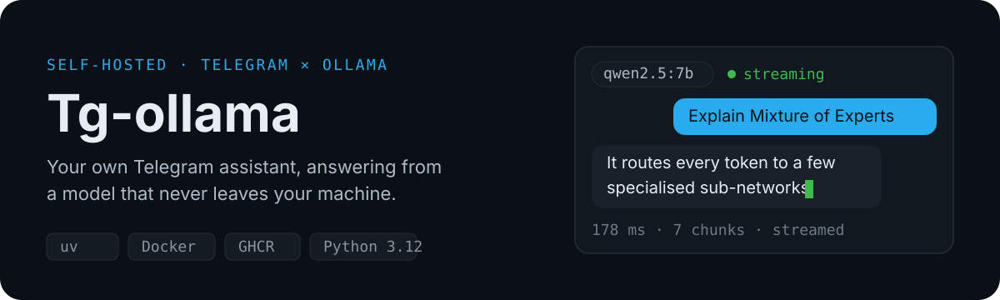
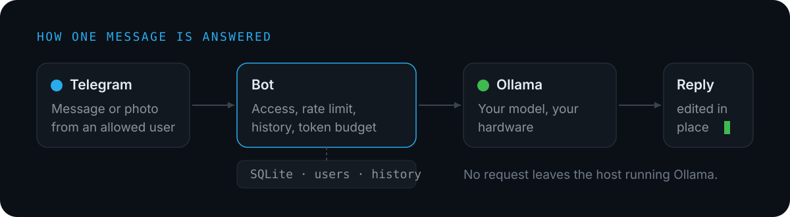

<p align="center">
  
</p>

<p align="center">
  <b>English</b> · <a href="README.ru.md">Русский</a>
</p>

<p align="center">
  <a href="https://github.com/Fgeeha/Tg-ollama/actions/workflows/docker.yml"></a>
  
</p>

Talk to your own Ollama models from Telegram. Answers stream in token by token,
conversations keep their context, and every request stays on the machine running
Ollama — no cloud provider, no per-token bill.

## Try it in three commands

You need [Ollama](https://ollama.com) running with at least one model pulled, and
a bot token from [@BotFather](https://t.me/BotFather).

```bash
cp .env.example .env          # add BOT_TOKEN and ADMIN_IDS
uv sync
uv run python -m bot.main
```

Send the bot a message and the reply starts appearing before the model has
finished thinking. `/models` switches between everything `ollama list` shows you.

## How a message is answered

<p align="center">
  
</p>

The bot checks that the sender is authorised and within their rate limit, loads
recent history within a token budget, streams the answer from Ollama, and edits
it into the message already on screen. History and users live in SQLite; the
model runs wherever `OLLAMA_HOST` points.

## What it does

| Capability | What that means in practice |
| --- | --- |
| **Streaming replies** | The message updates as tokens arrive, and `/stop` cancels a generation you no longer want. |
| **Any installed model** | Pick per user from the models Ollama reports; `/model_info` shows parameters, quantisation and family. |
| **Images** | Send a photo to a vision model such as `llava`. The bot checks the model's `vision` capability first and says so when it is missing. |
| **Context that fits** | History is trimmed to a token budget, so a long conversation does not silently overflow the model's window. |
| **Custom instructions** | `/system` sets a per-user system prompt. |
| **Access control** | Only users the admin adds can talk to the bot; test mode restricts it to the admin and survives a restart. |
| **Rate limiting** | Per-user message quotas, with the admin exempt. |
| **Long answers** | Replies over Telegram's 4096-character limit are split instead of being cut off. |

## Commands

**Everyone**

| Command | Purpose |
| --- | --- |
| `/start`, `/help`, `/status` | Register, show help, check bot and Ollama health |
| `/models`, `/switch_model`, `/current_model` | List, switch and show the active model |
| `/model_info [model]` | Parameters, quantisation, family and template |
| `/clear`, `/history`, `/regenerate` | Reset the conversation, show it, retry the last answer |
| `/stop` | Cancel the generation in progress |
| `/system [text]` | Show or set your system prompt |

**Admin only**

| Command | Purpose |
| --- | --- |
| `/add_user`, `/remove_user`, `/list_users` | Manage who may use the bot |
| `/stats` | Requests and response times per model |
| `/test_mode` | Restrict the bot to the admin |
| `/clear_history` | Wipe stored conversations |
| `/broadcast` | Message every active user |

## Configuration

Only the first two are required.

| Variable | Default | Meaning |
| --- | --- | --- |
| `BOT_TOKEN` | — | Token from @BotFather |
| `ADMIN_IDS` | — | Comma-separated Telegram user IDs of admins (`123,456`) |
| `BOT_MODE` | `polling` | Update delivery: `polling` or `webhook` |
| `WEBHOOK_URL` | — | Public HTTPS URL for Telegram; required when `BOT_MODE=webhook` |
| `WEBHOOK_HOST` / `WEBHOOK_PORT` / `WEBHOOK_PATH` | `0.0.0.0` / `8081` / `/webhook` | Where the built-in webhook server listens |
| `WEBHOOK_SECRET` | — | Secret token Telegram echoes back for verification |
| `OLLAMA_HOST` | `http://localhost:11434` | Where Ollama listens |
| `OLLAMA_API_KEY` | — | Bearer token for LiteLLM or another authenticated Ollama-compatible API |
| `OLLAMA_API_STYLE` | `ollama` | `ollama` (native `/api/*`) or `openai` (LiteLLM/proxies exposing only `/v1/*`) |
| `OLLAMA_TIMEOUT` | `60` | Seconds to wait for data; a stalled model is dropped |
| `DEFAULT_MODEL` | `llama2` | Model for users who never chose one |
| `MAX_CONTEXT_TOKENS` | `3000` | Token budget for conversation history |
| `OLLAMA_KEEP_ALIVE` | `10m` | How long Ollama keeps the model loaded |
| `OLLAMA_TEMPERATURE` | model's own | Sampling temperature |
| `OLLAMA_NUM_CTX` | model's own | Context window override |
| `RATE_LIMIT_MESSAGES` / `RATE_LIMIT_WINDOW` | `10` / `60` | Messages allowed per window, in seconds |
| `MAX_CONCURRENT_UPDATES` | `32` | Updates handled in parallel, so one slow answer does not block other users |
| `DATABASE_URL` | `sqlite:///data/bot.db` | SQLite or PostgreSQL |
| `TEST_MODE` | `false` | Admin-only mode |
| `LOG_LEVEL` | `INFO` | Logging level |
| `HEALTH_CHECK_ENABLED` / `HEALTH_CHECK_PORT` | `true` / `8080` | `/health` endpoint |

## Docker

```bash
docker compose up -d
```

Compose mounts `./data`, so the database survives a rebuild. If Ollama runs on
the host rather than in the compose network, point the bot at it:

```env
OLLAMA_HOST=http://host.docker.internal:11434
```

Images are published to GHCR on every push to `Master`:

```bash
docker run -d --env-file .env -v ./data:/app/data ghcr.io/fgeeha/tg-ollama:latest
```

## Development

```bash
uv sync              # install, including dev dependencies
uv run pytest -q     # run the test suite
uv run ruff check src/
```

Schema migrations run automatically at startup, including on databases created
before migrations existed.

## Notes and limits

- Vision needs a model that reports the `vision` capability; the bot refuses
  rather than sending an image a text model cannot read.
- Earlier images are not resent with later messages — the model is told a
  picture was shown but is no longer attached.
- One generation per user at a time; a second message waits rather than
  interleaving with the first.
- SQLite is the default and is fine for a personal bot. Point `DATABASE_URL` at
  PostgreSQL for anything larger.
